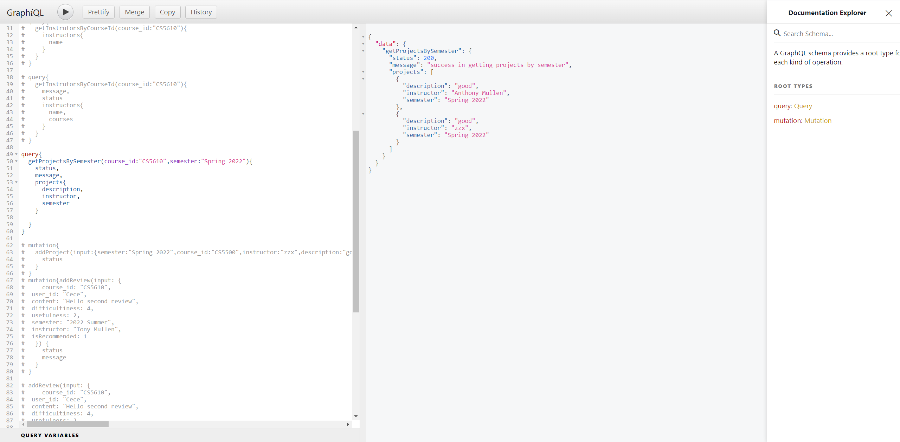

# NEU Course Wiki Backend

Members: Sixin Li, Zixin Zhao, Jiayan Ma

## Introduction

This is the NEU course Wiki Backend. We use MongoDB for the local database,express for the connection and GraphQL for the api. 

the backend includes four parts.

- Courses
- Instructors
- Reviews
- Projects

## DataBase

#### Courses

Courses include four parts of information.

- course_id
- name
- introduction
- timeline

#### Reviews

Reviews include nine parts of information.

- course_id
- user_id
- content
- creationDate
- rating_difficultiness
- rating_usefulness
- semester
- instructor
- isRecommended

#### Instructors

Courses include two parts of information.

- name
- courses(which is a list to save all the courses taught by the instructor)

#### Projects

Projects include five parts of information

- course_id
- semester
- instructor
- description
- link

## API

####        Courses

- addCourse
- updateCourse
- deleteCourse
- getCourseById

#### 		Instructors

- addInstructor
- updateInstructor
- getAllInstrutors
- getInstructorsByCourseId

#### 		Projects

- addProjects
- getProjectsByCourseId
- getProjectsByInstructor
- getProjectsBySemester

#### 		Reviews

- addReview
- deleteReview
- getReviewsByCourse
- getReviewsByUser
- getReviewsBySemester
- getReviewsByInstructor

## Route

The backend has four routes.

- http://localhost:5000/api/v1/instructors
- http://localhost:5000/api/v1/review
- http://localhost:5000/api/v1/projects
- http://localhost:5000/api/v1/course

To test all the routes and api, you can use GraphiQL to test.

## Iteration 1 features

We finish all the parts of backend and tested all the api.

#### Issues

When we connect the frontend and backend, we might need to adjust and update our api.

## Contribution

#### Sixin Li 

- ​      set up project, and built connection with MongoDB database (index.js and server.js)
- ​      created APIs for reviews (reviews.controller.js and reviewsDAO.js)
- ​      query: getReviewsByCourse, getReviewsByUser, getReviewsByInstructor, getReviewsBySemester
- ​      mutation: addReview, updateReviewVotes, deleteReview

#### Jiayan Ma

- ​      created APIs for courses(course.controller.js and courseDAO.js)
- ​      query: getCourseById
- ​      mutation: addCourse,updateCourse,deleteCourse

#### Zixin Zhao

- ​      created APIs for instructors(instructors.controller.js and instructorsDAO.js)
- ​      created APIs for projects(projects.controller.js and projectsDAO.js)
- ​      query: getProjectsByCourseId,getProjectsByInstructor,getProjectsBySemester,getAllInstrutors,getInstructorsByCourseId
- ​      mutation: addInstructor,updateInstructor,addProjects

## Iteration 2 features

Something Updated

#### Issues

When we connect the frontend and backend, we might need to adjust and update our api.

## Contribution

#### Sixin Li 

- ​       add a course filter for getReviewBySemester and getReviewByInstructor functions

## Iteration 3 features

  Something Updated

  #### Issues

  When we connect the frontend and backend, we might need to adjust and update our api.

  ## Contribution

  #### Sixin Li 

  - ​      Make requests return review_id for further interactions

  

  

  

## Heroku Deploy

https://neu-course-wiki-backend.herokuapp.com/

